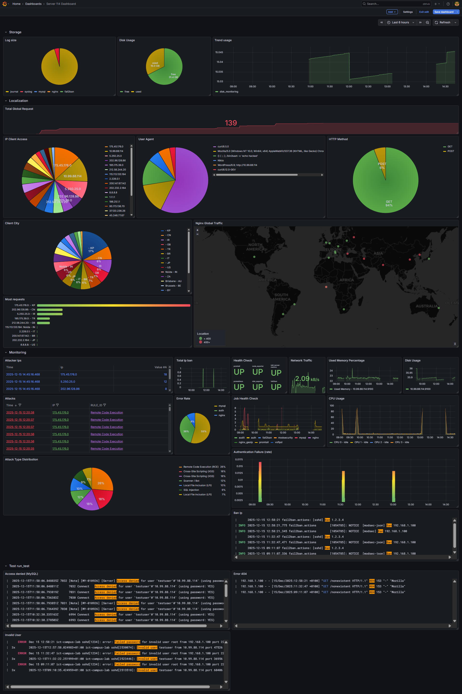

# 🛡️ Server Monitoring & Security Dashboard

  

A comprehensive **Grafana** dashboard designed for Linux servers, utilizing the **PLG Stack** (Prometheus, Loki, Grafana).

This project provides a **360° view** of your infrastructure, combining standard **Hardware Metrics** (CPU, RAM, Disk) with deep **Security Insights** (WAF attacks, Fail2Ban bans, Brute Force attempts) and **Traffic Analysis** (GeoIP).




---

## 🏗️ Architecture & Requirements

**⚠️ Important:** This project implements a distributed monitoring system. The repository contains configurations for two distinct roles:

1.  **Monitoring Host (e.g., Laptop/WSL/Docker):** Runs the backend stack (Grafana, Loki, Prometheus).
2.  **Target Server (e.g., Production VM):** Runs the services (Nginx, MySQL) and the collectors (Promtail, Node Exporter, Fail2Ban, ModSecurity).

### 📂 Repository Structure

The repository is organized to keep configurations clean and separated:

```text
.
├── configs/                  # Configuration files for services
│   ├── fail2ban/             # Jail definitions and filters
│   ├── modsecurity/          # WAF rules and setup
│   ├── nginx/                # Web server config (JSON logs)
│   ├── prometheus/           # Prometheus scrape config
│   └── promtail/             # Log shipping config
├── dashboards/               # Grafana JSON Model
├── scripts/                  # Custom Python/Bash scripts (Exporters & Bots)
├── service/                  # Systemd .service unit files
├── docker-compose.yml        # (Optional) Docker orchestration
└── README.md
```

## 🚀 Setup Guide

### 1. Target Server Configuration ( The "Victim" )

**Nginx & ModSecurity:**
* Replace your `/etc/nginx/nginx.conf` with the one provided in `configs/nginx/`. It enables JSON logging required for the GeoMap.
* Ensure ModSecurity is installed and configured using files in `configs/modsecurity/`.

**Fail2Ban:**
* Copy `configs/fail2ban/jail.local` to `/etc/fail2ban/`. This sets up the custom jails for SSH and Nginx.

**Exporters:**
* Install **Node Exporter** and **Promtail**.
* Use `configs/promtail/promtail-config.yaml` as your config. **Update the `clients: url`** to point to your Monitoring Host IP.

**Custom Scripts (Scripts Folder):**
* **Disk Exporter:** Copy `scripts/disk_exporter.py` to `/usr/local/bin/`. This Python script exposes directory sizes for the "Log Size" panel.
* **Telegram Bot:** Copy `scripts/fail2ban_telegram_bot.py` to `/usr/local/bin/`.
    * ⚠️ **ACTION REQUIRED:** Edit the script and insert your real `BOT_TOKEN` and `CHAT_ID`.
* **Systemd:** Use the unit files in `service/` to enable these scripts on boot (e.g., `sudo systemctl enable disk-exporter`).

### 2. Monitoring Host Configuration ( The "Observer" )

**Prometheus & Loki:**
* Use `configs/prometheus/prometheus.yml` and `configs/promtail/loki-config.yaml`.
* ⚠️ **ACTION REQUIRED:** Edit `prometheus.yml` and update the `targets` list with the real IP address of your Target Server.

**Grafana:**
1.  Open Grafana -> **Dashboards** -> **New** -> **Import**.
2.  Upload `dashboards/Dashboard Infocube stage.json`.
3.  Select your Prometheus and Loki datasources when prompted.

---

## 📊 Features Overview

* **Health Check:** Uptime status for collectors (Promtail, Node Exporter).
* **Hardware:** CPU Usage, RAM Usage, Network Traffic (Input/Output).
* **Storage:** Granular **Log Directory Size** analysis via custom exporter.
* **Global Map:** Real-time visualization of visitor locations (Nginx Global Traffic).
* **WAF Insights:** Detailed analysis of ModSecurity blocked attacks (SQLi, XSS, RCE) parsed from JSON logs.
* **Fail2Ban:** Real-time list of banned IPs and interactive Telegram notifications.

---

## 🔧 Troubleshooting

* **"Context Deadline Exceeded" in Prometheus:** Check your Target Server firewall. Ensure ports `9100` (Node Exp), `9200` (Disk Exp) and `9000` (Fail2Ban Exp) are open.
* **Empty GeoMap:** Verify that Nginx is logging the `geoip_city` field and Promtail is scraping it under the job label `nginx_geoip`.
* **Script Errors:** Check logs with `journalctl -u disk-exporter -f`. Ensure Python dependencies are installed (`pip install prometheus_client`).

---

## ⚠️ Security Notice

All configuration files in this repository have been sanitized.

* **Passwords & Tokens:** Replaced with placeholders like `INSERT_TOKEN_HERE`.
* **IP Addresses:** Replaced with generic examples.

**Before deploying, make sure to update these values with your actual infrastructure details.**
